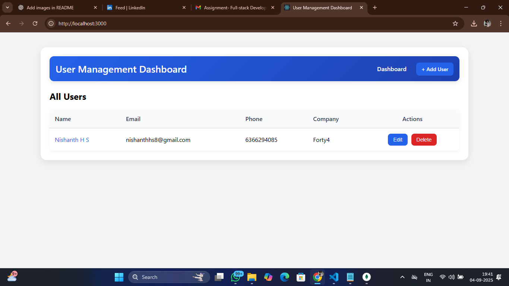
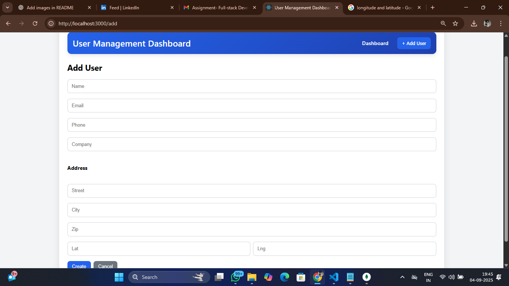
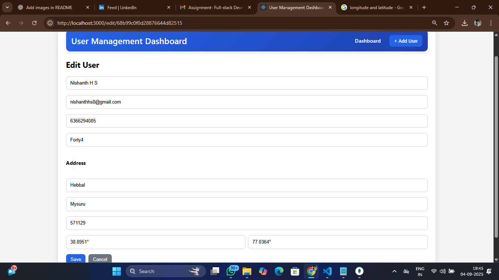

# User Management Dashboard

Fullstack CRUD app built with:

* Frontend: React.js, React Router, Axios
* Backend: Node.js, Express.js
* Database: MongoDB (Mongoose)
* Styling: Tailwind CSS / Bootstrap / Plain CSS

---

## Features

* View a list of users on a dashboard
* Add new users with a form
* Edit and delete users
* View user details
* Client-side and server-side validations
* Responsive UI

---

## Tech Stack

* Frontend: React.js (functional components + hooks), React Router, Axios
* Backend: Node.js, Express.js
* Database: MongoDB with Mongoose
* Styling: Tailwind CSS / Bootstrap / Plain CSS

---

## Run Locally

### Backend

```bash
cd backend
cp .env.example .env
# set MONGO_URI in .env (use MongoDB Atlas or local)
npm install
npm run dev
```

### Frontend

```bash
cd frontend
npm install
npm start
# The app will run on http://localhost:3000
```

---

## API Endpoints

* `GET /api/users` → Get all users
* `GET /api/users/:id` → Get user by ID
* `POST /api/users` → Create a new user
* `PUT /api/users/:id` → Update a user
* `DELETE /api/users/:id` → Delete a user

---

## Screenshots

### Dashboard



### Create User Form



### User Details



---

## Submission Notes

* Ensure both `frontend` and `backend` folders are included in your GitHub repo.
* Include this README.md file.
* Screenshots folder is optional but recommended to showcase your work.
